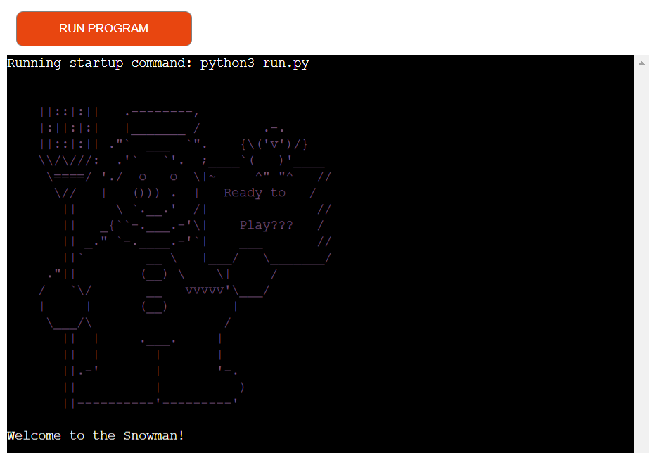
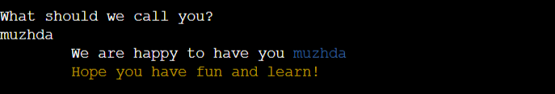
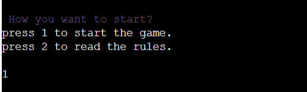
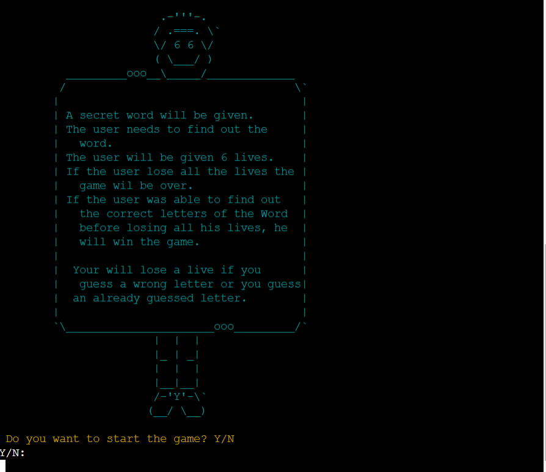
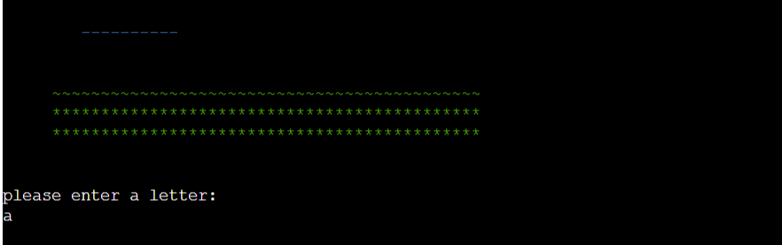
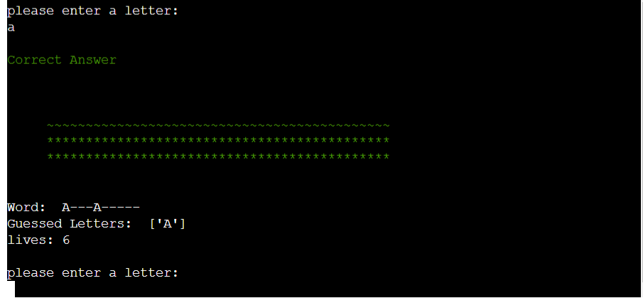
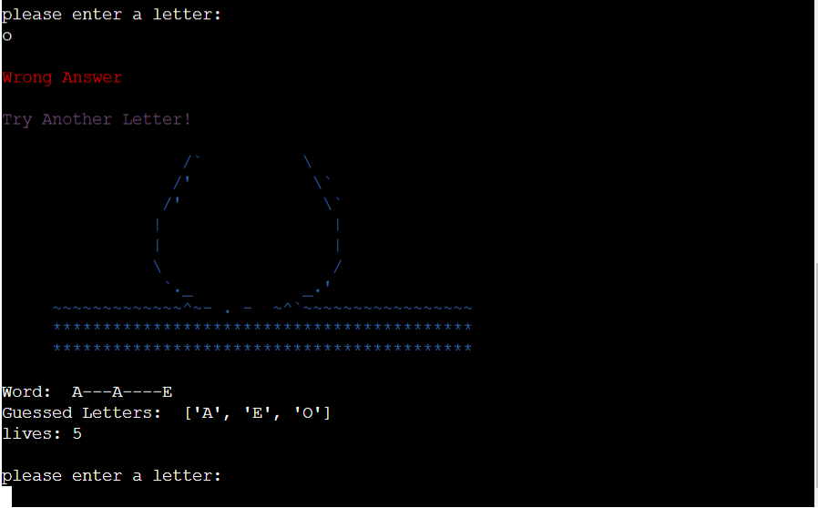
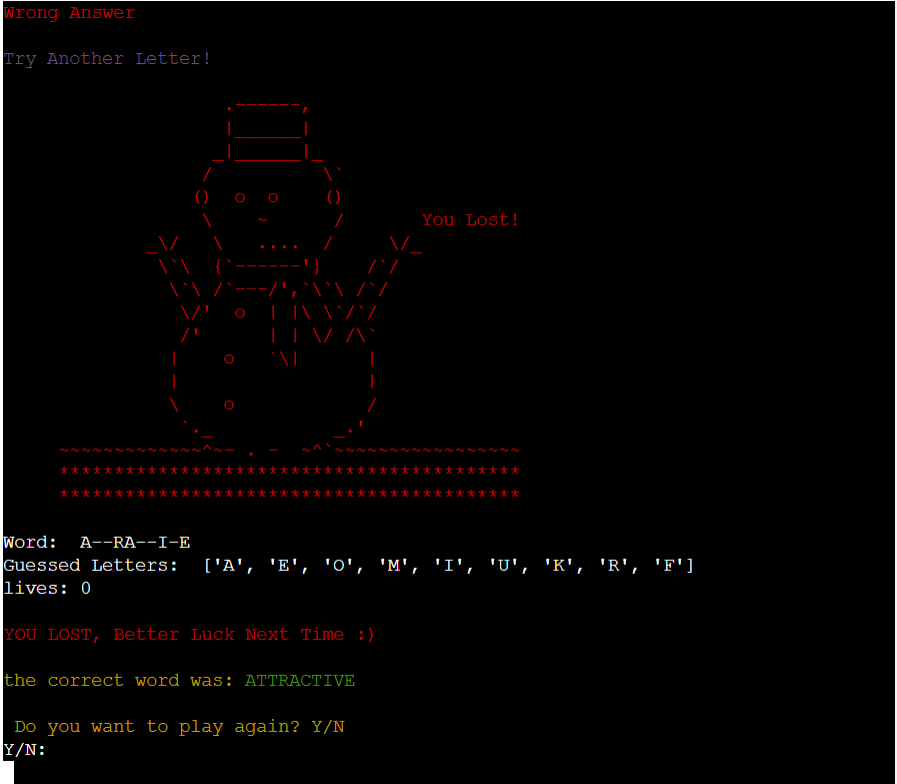
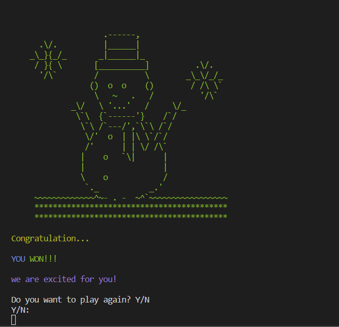
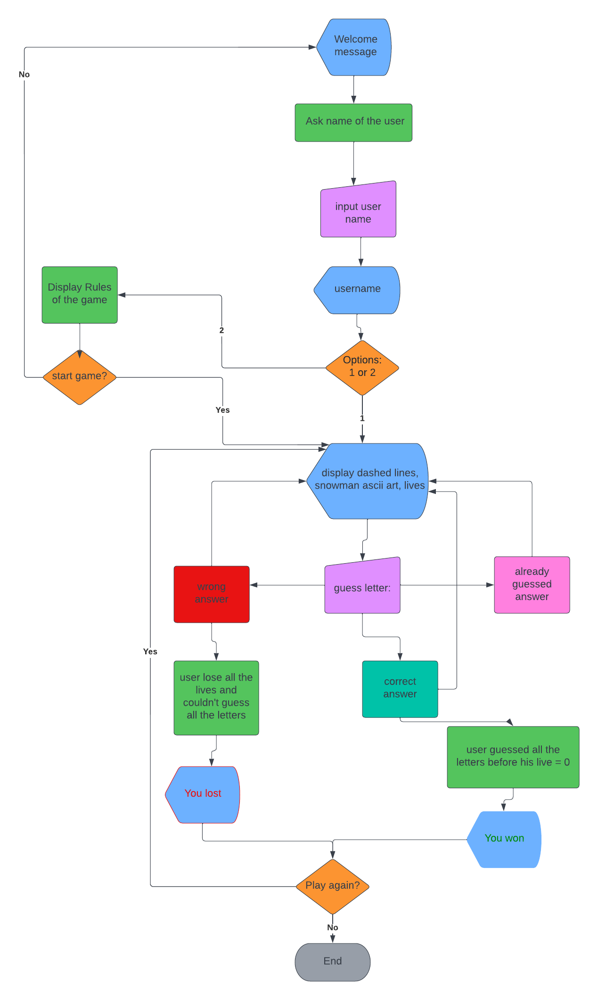

# Snowman Game

## Purpose of the project
Snowman is a secret word game where the user needs to guess the letters of a word to find it. The user will be given specific lives to guess the letters of the word. If the user couldn't guess the word and lose all the given chances (lives). The user will lose the game otherwise will win the game.

This game was desingned purely in Python. Also, this game is fun to play and will help test the memory with secret letters and words. As our body needs excersie so does our brain. Therefore, this game can be a good excersie for the brain.

 
 
Visit the live website [in here](https://snowman-game-pp3.herokuapp.com/)
 

## Table of Contents
  * [Purpose of the project](#purpose-of-the-project)
  * [User Stories](#user-stories)
  * [Features](#features)
  * [Future Features](#future-features)
  * [Typography and color scheme](#typography-and-color-scheme)
  * [Flow chart](#flow-chart)
  *  [Testing](#testing)
      * [Validator Testing](#validator-testing)
      * [Supported Screens and Browsers](#supported-screens-and-browsers)
      * [Fixed Bugs](#fixed-bugs)
  *  [Deployment](#deployment)
  *  [Credits](#credits)
      * [Contents](#contents)

-----

## User Stories
- As visiting user, I would like to see a friendly message at the begining of the game and enter my number. 
- As visiting user, I would like to check the rules of the game. 
- As visiting user, I would like to see the already guessed words
- As visiting user, I would like to see error message, if i guessed the wrong or an already guessed letter.
- As visiting user, I would like to see the snowman being build if i guessed the wrong or already guessed letter.
- As visiting user, I would like to have five to six lives.
- As visiting user, I would like to see the correct guessed letter in to dashed lines.
- As visiting user, I would like to see the word, if i couldn't find all the letters of the word and lose all the chances (lives).
- As visiting user, I would like to start the game after checking the rules.
- As visiting user, I would like to have an option to re-strart the game if I lose or win.

#### [Back to Top](#table-of-contents)
---
## Features

- Welcome message at the beging of the game.
  

- Asking for the username

  

- Menu options:
	- Two options will be given to the user to start the game or go to the rules of the game
  

- Game rules section
  - Rules of the game will be displayed. After that user will be asked to start the game or not.
    If the answer will be no, he will be returned to the main menu. If use, the game will start.
  

- Steps to show the Snowman drawing
    When the game starts the user needs to find out the secret word by entering a letter.

    User will be asked to guess a letter for the secret word.
    

    If user enters correct letter, a message will be shown and dashed line will be replaced by the letter.
    Also, the snowman will not be build
    

    If user enters wrong letter, a red line message will be shown and a live will be deducted. 
    Also, the snowman will be build.
    

    If user guesses the already entered or gussed letter, another warning message will be shown and a live will be deducted.
    Also, the snowman will be build.
    

    If the user lose all the lives, then he will lose.
    The user will be asked to continue the game or not.
    

    If the user was able to guess the word before losing his all lives, he will win the game.
    The user will be asked to continue the game or not.
    

#### [Back to Top](#table-of-contents)
---
## Future Features
- Add levels to the game.
- Improve the game by displaying meaning of the words so the user could guess the word easily.

---
## Typography and color scheme
  ### Typography
  - Font family, 'Arial' was used for this project.
  - Used colors: red, green, cyan, magenta, white, yellow
  ----

## Flow chart

  
 
 image 

  

  

#### [Back to Top](#table-of-contents)
---
## Technology
  - Python 

## Python Libraries
- [Random](https://docs.python.org/3/library/random.html)
- [Colorma](https://pypi.org/project/colorama/)
- [Time](https://docs.python.org/3/library/time.html)
  

 ### Programs that were used:
  - [Heroku](https://dashboard.heroku.com/apps)
  - [Github](https://github.com/)
  - [Gitpod](https://gitpod.io/)
  - [Am I responsive](https://ui.dev/amiresponsive)
  - [Lucid chart](https://www.lucidchart.com/)
  

#### [Back to Top](#table-of-contents)
---
## Testing
- PP8: Passed the code through PP8 validator and no bugs were founded.
- Given invalid inputs: numbers when numbers were expected and out of bound inputs. 

  ### Validator Testing
    - [PP8](http://pep8online.com/)
        - The code in run.py file was successfull and there were no errors
        - The code in snowman.py file had a certain amount of trailing whitespace in ascii character which hasn't been fixed. The whole ascii character should have been modified to remove this syntax error. Due to limited amount of, I was not able to fix it. Although this syntax error doesn't effect the overall  of the website.

  ### Supported Screens and Browsers
    - This site is not fully responsive in the mobile devices.
    - You can run this site in a PC.

## Fixed bugs
1. Trailing whitespace: 
    - Trailing whitespace is any spaces or tabs after the last non-whitespace character on the line until the newline.
    - I encoutred this syntax error, and solved it by deleting extra spaces from the end of the lines.

2. continuation line over-indented for visual indentflake8(E127)
- A continuation line is indented farther than it should be for a visual indent. [source](https://www.flake8rules.com/rules/E127.html)
    - The characters in the line was greater than 79 therefore, I put the half of the code from that line to another. 
    - The error was due to one indtetion.
    - Solved it by deleting the indentation.

3. module level import not at top of file pp8:
    - A comment was given between imports, which caused this error.
    - Solved by removing the comment, [source](https://www.flake8rules.com/rules/E402.html)

#### [Back to Top](#table-of-contents)
---

## Deployment 
  This site was developed in Gitpod and deployed using Code Institute's mock terminal for Heroku.

  - Steps for deployment:
    - Go to Heroku website
    - create a new Heroku app
    - Settings -> set the buildbacks to Python and Nodejs consecutively
    - Settings -> Create a Config Var called PORT, Set this to 8000
    - Deploy -> Link the Heroku app to github repository
    - Deploy -> select enable automatic deploy or |deploy branch -> Deploy|
    - click open app from the menu to go to live website

#### [Back to Top](#table-of-contents)
---
## Credits
  Thank to my mentor Rohit Sharma and Code Institute family who helped me throughout this project.
  
  ### Contents
  - The whole idea of the project was taken from [video](https://www.youtube.com/watch?v=cJJTnI22IF8) although the features and code has been changed according to the game.
  - Ascii art was taken from the below website, but it was modified according to the need:
    - [Rules of game](https://www.tecmint.com/boxes-draws-ascii-art-boxes-in-linux-terminal/)
    - [Welcome message snowman](https://ascii.co.uk/art/snowman)
    - [snowman](https://asciiart.website/index.php?art=holiday/christmas/snowman)
  - The list of random words were taken from [Stakoverflow](https://stackoverflow.com/questions/594273/how-to-pick-a-random-english-word-from-a-list)
  - The idea for time.sleep() was taken from [freeCodeCamp](https://www.freecodecamp.org/news/python-sleep-time-sleep-in-python/)
  - Replacing dashed with letter were taken from [stackoverflow2](https://stackoverflow.com/questions/61964490/how-to-replace-dash-with-letter-hangman) [stackoverflow2](https://stackoverflow.com/questions/57204695/replace-underscore-with-correct-guess-letter-python-hangman) and it was modifided. 

#### [Back to Top](#table-of-contents)